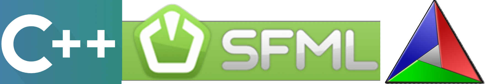
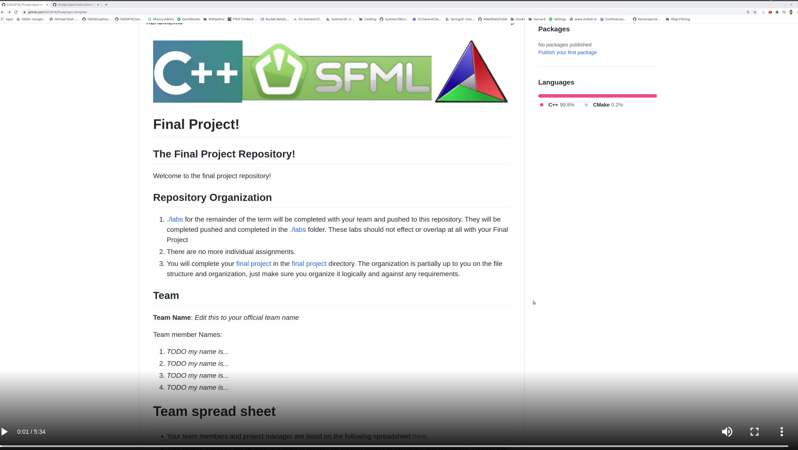

# Final Project!

## The Final Project Repository!

Welcome to the final project repository!  

Here is a welcome video showing the repoisory organization--be sure to read carefully through the instructions (Consuming a large spec and breaking it down is part of engineering!).

https://youtu.be/O1WwJ0uXl94

## Repository Organization 

1. [./labs](./labs) for the remainder of the term will be completed with your team and pushed to this repository. They will be completed pushed and completed in the [./labs](./labs) folder. These labs should not effect or overlap at all with your Final Project
2. There are no more individual assignments.
3. You will complete your [final project](./FinalProject) in the [final project](./FinalProject) directory. The organization is partially up to you on the file structure and organization, just make sure you organize it logically and against any requirements.

## Team

**Team Name**: *Edit this to your official team name*

Team member Names:

1. Emily
2. Katherine
3. Jason
4. Archita
5. Shashank

# Team spread sheet 

- Your team members and project manager are listed on the following spreadsheet [here](https://docs.google.com/spreadsheets/d/1kFt7rN4h6Asv9jWLwrUrPf-YufGeq6EmzUZhYiFaEKw/edit?usp=sharing). 
- Your project manager will be your first point of contact for various project deliverables and questions. Though you may continue to attend office hours with whoever you like, your project manager will be your primary contact.

## Team Logistics

- Work with your team to ensure everyone has a way to work on this codebase with a common set of tools.
- Everyone should make code contributions to the repository (i.e. everyone should have some commits in the project log)
- See the project timeline

## Notes on working in teams

* [Four Ways to Lead Your Software Team to Success](https://hackernoon.com/four-ways-to-lead-software-team-to-success-43fa156719b4)
* [The 3 C's of being a captain](https://appliedsportpsych.org/resources/resources-for-athletes/the-3-c-s-of-being-a-captain/)
* [Etiquette for Pair Programming](https://dzone.com/articles/etiquette-for-pair-programming)

# Rubric
 
<table>
	<tbody>
		<tr>
			<th>Points</th>
			<th align="center">Description</th>
			</tr>
			<tr>	  
			<td>5% (Milestone Check-in #1)</td>
				<td align="left">
					<ul><li>Did you complete your check-in #1?</li><li>Was a timeline present?</li><li>Were there at least 15 tasks created in the 'Projects' tab</li></ul>
				</td>
		</tr>
	</tbody>
</table>

<table>
	<tbody>
		<tr>
			<th>Points</th>
			<th align="center">Description</th>
			</tr>
			<tr>	  
			<td>5% (Milestone Check-in #2)</td>
			<td align="left">
				<ul><li>Did you complete your check-in #2?</li>
			</td>
		</tr>
	</tbody>
</table>

<table>
	<tbody>
		<tr>
			<th>Points</th>
			<th align="center">Description</th>
			</tr>
			<tr>	  
			<td>5% (Youtube Video)</td>
			<td align="left">
				<ul><li>Did you upload a Youtube Video and test out opening it incognito mode so we could also access it?</li>
			</td>
		</tr>
	</tbody>
</table>

<table>
  <tbody>
    <tr>
      <th>Points</th>
      <th align="center">Description</th>
    </tr>
     <tr>
	<td>5% (Team Assessment)</td>
	<td align="left"><ul><li>Did you complete the assessment form which earns you 1%--the other 4% is determined by your team members responses</li></ul></td>
    </tr>	     
  </tbody>
</table>  

<table>
  <tbody>
    <tr>
      <th>Points</th>
      <th align="center">Description</th>
    </tr>
     <tr>
	<td>25% (Polish and completion)</td>
	<td align="left"><ul><li>How polished are your materials(timeline, documentation, presentation)? Does your software work? Does it compile? Does it crash, segfault?</li></ul></td>
    </tr>	     
  </tbody>
</table>  

<table>
  <tbody>
    <tr>
      <th>Points</th>
      <th align="center">Description</th>
    </tr>	     
      <td>10% (Feature of your choice)</td>
	<td align="left"><ul><li>Does your feature work? Do you have at least 1 test case</li></ul></td> 
    </tr>
  </tbody>
</table>

<table>
  <tbody>
    <tr>
      <th>Points</th>
      <th align="center">Description</th>
    </tr>	     
      <td>20% (Networking)</td>
	<td align="left"><ul><li>Does your networking work?</li></ul></td> 
    </tr>
  </tbody>
</table>

<table>
  <tbody>
    <tr>
      <th>Points</th>
      <th align="center">Description</th>
    </tr>	     
      <td>10% (Testing)</td>
	<td align="left"><ul><li>Do you have at least 8 test cases? Are they properly integrated with a Github Action?</li></ul></td> 
    </tr>
  </tbody>
</table>

<table>
  <tbody>
    <tr>
      <th>Points</th>
      <th align="center">Description</th>
    </tr>	     
      <td>15% (Past Assignment Integration)</td>
	<td align="left"><ul><li>Did you integrate all other features from previous assignments?</li></ul></td> 
    </tr>
  </tbody>
</table>

